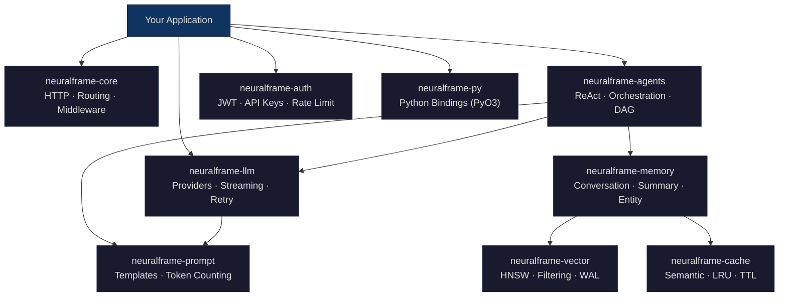

# NeuralFrame

**An AI-native web framework for Rust — HTTP server, LLM orchestration, vector search, and agent runtime in one workspace.**

[](https://github.com/MrinallSamal-byte/GDG_team/actions)
[](https://github.com/MrinallSamal-byte/GDG_team/actions/workflows/security.yml)
[](LICENSE)
[](https://www.rust-lang.org)

---

NeuralFrame eliminates the glue code between your HTTP layer, LLM providers, vector database, memory engine, and agent runtime — shipping them as a single, type-safe Rust workspace with zero Python runtime dependencies.

---

## Feature Overview

| Feature | Status | Notes |
|---------|--------|-------|
| HTTP server + routing | ✅ Done | Radix tree, wildcards, param priority |
| Middleware pipeline | ✅ Done | `handle` + `post_process` hooks, reverse-order post-processing |
| Compression (gzip) | ✅ Done | Post-process hook, min_size threshold, `Vary` header |
| Graceful shutdown | ✅ Done | SIGINT + SIGTERM, configurable drain timeout |
| SSE streaming responses | ✅ Done | `ResponseBody::SseEvents` |
| OpenAI provider | ✅ Done | complete, stream, embed, tool_calls |
| Anthropic provider | ✅ Done | complete, stream (embed unsupported by API) |
| Google Gemini provider | ✅ Done | complete, stream, embed |
| Ollama provider | ✅ Done | complete, stream, embed |
| Groq provider | ✅ Done | complete, stream (embed unsupported by API) |
| Provider failover | ✅ Done | Full chain — embed + stream both covered |
| Prompt templating | ✅ Done | Variables, conditionals, loops |
| Token counting | ✅ Done | Real tiktoken, gpt-4 fallback, char/4 last resort |
| HNSW vector index | ✅ Done | m=1 safe, ef_construction tunable |
| Metadata filtering | ✅ Done | Eq, Ne, And, Or combinators |
| Vector persistence | ✅ Done | WAL + snapshot, replay on load |
| Vector benchmarks | ✅ Done | Criterion — cosine, euclidean, dot, insert, search |
| InMemory backend | ✅ Done | Sliding window, word-overlap scoring |
| SQLite backend | ✅ Done | sqlx, WAL mode, blob embeddings |
| Redis backend | ✅ Done | Async, RPUSH/LTRIM, session-keyed |
| Postgres backend | ✅ Done | sqlx PgPool, OnceCell, UPSERT |
| Semantic cache | ✅ Done | blake3 keys, true LRU, TTL, `CacheStats` |
| ReAct agent | ✅ Done | Real LLM loop, multi-line Action Input parser |
| DAG planning | ✅ Done | Dependency tracking, `next_steps()`, `progress()` |
| Orchestrator | ✅ Done | Sequential, parallel, tolerant, aggregate |
| Built-in tools | ✅ Done | EchoTool, CurrentTimeTool |
| JWT auth | ✅ Done | HS256, sign/verify, audit logging |
| API key auth | ✅ Done | Revoke, per-key rate limiting, audit logging |
| Python bindings | ✅ Done | Async completion, PyVectorStore, PySemanticCache |
| Anthropic tool_calls | 🚧 Partial | HTTP works — response not parsed into `ToolCall` |
| Gemini tool_calls | 🚧 Partial | HTTP works — response not parsed into `ToolCall` |
| Prometheus metrics | 📋 Planned | Counter types designed, endpoint not wired |
| Circuit breaker | 📋 Planned | States designed, struct not implemented |
| OpenTelemetry traces | 📋 Planned | Dep in workspace, no spans created |
| API versioning MW | 📋 Planned | Not implemented |
| Sliding window rate limit | 📋 Planned | Fixed window only today |
| Batch embeddings | 📋 Planned | Single embed only |
| WASM target | 📋 Planned | Research phase |
| gRPC transport | 📋 Planned | Research phase |

---

## Architecture



```
neuralframe/
├── Cargo.toml                     # Workspace root
├── crates/
│   ├── neuralframe-core/          # HTTP server, routing, middleware
│   ├── neuralframe-llm/           # LLM providers, streaming, retry
│   ├── neuralframe-prompt/        # Prompt templating, token counting
│   ├── neuralframe-vector/        # HNSW vector store, metrics
│   ├── neuralframe-memory/        # Multi-tier memory engine
│   ├── neuralframe-cache/         # Semantic LLM response cache
│   ├── neuralframe-agents/        # ReAct agents, orchestration
│   ├── neuralframe-auth/          # API key, JWT auth
│   └── neuralframe-py/            # Python bindings (PyO3 + maturin)
├── examples/
│   ├── chatbot_server.rs
│   ├── rag_pipeline.rs
│   └── multi_agent.rs
└── tests/
    ├── integration_core.rs
    ├── integration_vector.rs
    ├── integration_memory.rs
    ├── integration_agents.rs
    ├── integration_auth.rs
    └── integration_cache.rs
```

---

## Quick Start

Add the crates you need:

```sh
cargo add neuralframe-core
cargo add neuralframe-llm
cargo add neuralframe-vector
cargo add neuralframe-memory
cargo add neuralframe-cache
cargo add neuralframe-agents
cargo add neuralframe-auth
cargo add neuralframe-prompt
```

### Hello World

```rust
use neuralframe_core::prelude::*;

#[tokio::main]
async fn main() {
    NeuralFrame::new()
        .get("/hello", |_req| async {
            Response::ok().json(serde_json::json!({"message": "Hello, NeuralFrame!"}))
        })
        .bind("0.0.0.0:8080")
        .run()
        .await
        .expect("server failed");
}
```

---

## Crate-by-Crate Guide

### neuralframe-core — HTTP Server, Routing, Middleware

Radix-tree router with static-first priority (`static > :param > *wildcard`). Hyper 1.x integration. Middleware executes `handle()` in registration order, `post_process()` in reverse. Graceful shutdown drains in-flight connections on SIGINT/SIGTERM.

**Path params + JSON body:**

```rust
use neuralframe_core::prelude::*;
use serde::Deserialize;

#[derive(Deserialize)]
struct ChatMessage { content: String }

NeuralFrame::new()
    .get("/users/:id", |req| async move {
        let id = req.params.get("id").cloned().unwrap_or_default();
        Response::ok().json(serde_json::json!({"user_id": id}))
    })
    .post("/chat", |req| async move {
        match req.json::<ChatMessage>() {
            Ok(msg) => Response::ok().text(&msg.content),
            Err(_) => Response::bad_request("invalid JSON"),
        }
    });
```

**Middleware pipeline:**

```rust
use neuralframe_core::prelude::*;

NeuralFrame::new()
    .middleware(LoggingMiddleware::new())
    .middleware(CorsMiddleware::permissive())
    .middleware(RateLimitMiddleware::per_minute(100))
    .middleware(BodyLimitMiddleware::megabytes(10))
    .middleware(RequestIdMiddleware::new())
    .middleware(CompressionMiddleware::new().min_size(1024))
    .handler_timeout(std::time::Duration::from_secs(30))
    .shutdown_timeout(std::time::Duration::from_secs(30));
```

**Custom middleware:**

```rust
use neuralframe_core::middleware::{Middleware, MiddlewareResult};
use neuralframe_core::prelude::*;
use async_trait::async_trait;

#[derive(Debug)]
struct ApiKeyGuard { required_key: String }

#[async_trait]
impl Middleware for ApiKeyGuard {
    async fn handle(&self, req: Request) -> MiddlewareResult {
        match req.headers.api_key("x-api-key") {
            Some(key) if key == self.required_key =>
                MiddlewareResult::Continue(req),
            _ =>
                MiddlewareResult::ShortCircuit(Response::unauthorized("invalid key")),
        }
    }
    fn name(&self) -> &str { "api_key_guard" }
}
```

Built-in middleware: `LoggingMiddleware`, `CorsMiddleware`, `RateLimitMiddleware` (fixed window), `CompressionMiddleware` (gzip), `RequestIdMiddleware`, `BodyLimitMiddleware`, `TimeoutMiddleware`.

---

### neuralframe-llm — LLM Providers, Streaming, Retry

Five providers — **OpenAI**, **Anthropic**, **Google Gemini**, **Ollama**, **Groq** — all implementing the `LLMProvider` trait with `complete()`, `stream()`, and `embed()`. `ResilientClient` chains primary → fallback providers with exponential backoff + jitter. 429 and 5xx are retryable; 4xx is not.

**Resilient completion:**

```rust
use neuralframe_llm::prelude::*;
use neuralframe_llm::retry::{ResilientClient, RetryConfig};

let client = ResilientClient::new(OpenAIProvider::new("sk-..."))
    .with_fallback(AnthropicProvider::new("sk-ant-..."))
    .with_fallback(GroqProvider::new("gsk_..."))
    .with_retry(RetryConfig::new(3));

let req = CompletionRequest::new("gpt-4o")
    .system("You are a helpful assistant.")
    .user("Explain Rust ownership in one sentence.")
    .max_tokens(100)
    .temperature(0.7);

let response = client.complete(req).await?;
println!("{}", response.content);
```

**Streaming tokens (SSE):**

```rust
use neuralframe_llm::prelude::*;
use futures::StreamExt;

let provider = OpenAIProvider::new("sk-...");
let req = CompletionRequest::new("gpt-4o")
    .user("Write a haiku about Rust.")
    .streaming();

let mut stream = provider.stream(req).await?;
while let Some(token) = stream.next().await {
    match token {
        Ok(t) if !t.done => print!("{}", t.content),
        Ok(_) => println!(),
        Err(e) => eprintln!("stream error: {}", e),
    }
}
```

Tool calling types (`ToolDefinition`, `ToolCall`, `ToolResult`) and `ToolRegistry` with parallel execution are included. **Note:** Tool-call response parsing currently works for OpenAI only. Anthropic and Gemini tool-call responses are not yet parsed into `ToolCall` structs (🚧).

---

### neuralframe-prompt — Prompt Templating, Token Counting

`PromptTemplate` with `{{ variable }}` substitution, `...` conditionals, and `...` loops. `PromptRegistry` supports versioned templates with A/B selection. Token counting uses real tiktoken with a gpt-4 → char/4 fallback chain.

```rust
use neuralframe_prompt::{PromptTemplate, count_tokens, truncate_to_tokens, PromptBuilder};

let tmpl = PromptTemplate::new("Hello {{ name }}, you have {{ count }} messages.");
let rendered = tmpl.render(&[("name", "Alice"), ("count", "3")]);

let tokens = count_tokens("Explain ownership in Rust.", "gpt-4o");
let truncated = truncate_to_tokens("A very long text...", 50, "gpt-4o");

let prompt = PromptBuilder::new()
    .system("You are a helpful assistant.")
    .user("What is Rust?")
    .context("Rust is a systems programming language.")
    .build();
```

---

### neuralframe-vector — HNSW Vector Store

In-process HNSW index with configurable `m` and `ef_construction`. Supports Cosine, Euclidean, and DotProduct distance metrics. SIMD-friendly 4-wide unrolled similarity loops. Persistent storage via WAL (`wal.jsonl`) + snapshot (`snapshot.jsonl`) with replay on load.

**Insert and search with metadata filtering:**

```rust
use neuralframe_vector::{VectorStore, DistanceMetric, Filter};

let store = VectorStore::new(384, DistanceMetric::Cosine);

store.insert("doc1", embedding, serde_json::json!({
    "topic": "rust",
    "source": "blog"
}))?;

let results = store.search(
    &query_embedding,
    5,
    Some(&Filter::Eq("topic".into(), serde_json::json!("rust"))),
)?;
```

**Persistent storage:**

```rust
use neuralframe_vector::{VectorStore, DistanceMetric};
use neuralframe_vector::storage::StorageConfig;

let config = StorageConfig::new(std::path::Path::new("./data/vectors"));

// Save
store.save_to_disk(&config)?;

// Load (replays WAL on top of snapshot)
let store = VectorStore::load_from_disk(&config, 384, DistanceMetric::Cosine)?;
```

Filters: `Filter::Eq`, `Filter::Ne`, `Filter::And`, `Filter::Or`.

---

### neuralframe-memory — Multi-Tier Memory Engine

Four storage backends (InMemory, SQLite, Redis, Postgres) behind the `MemoryStore` trait. Four memory strategies: `ConversationMemory` (sliding window), `SummaryMemory` (LLM-powered summarization), `VectorMemory` (similarity-threshold retrieval), `EntityMemory` (named-entity storage with type tagging). `ContextBuilder` assembles context entries greedily within a token budget.

```rust
use neuralframe_memory::prelude::*;
use neuralframe_memory::backends::sqlite::SqliteStore;
use std::sync::Arc;

let store: Arc<dyn MemoryStore> = Arc::new(SqliteStore::new("./data/memory.db"));
let mem = ConversationMemory::new(Arc::clone(&store), 10);

mem.add("session-1", "user", "Hello!").await?;
mem.add("session-1", "assistant", "Hi there!").await?;

let context = mem.get_context("session-1").await?;
```

---

### neuralframe-cache — Semantic LLM Response Cache

DashMap-backed cache with exact match (blake3 content-addressed keys) and semantic match (cosine similarity above threshold). True LRU via `last_accessed: Instant` updates on every hit. TTL expiry on both lookup paths.

```rust
use neuralframe_cache::{SemanticCache, CacheConfig};
use std::time::Duration;

let cache = SemanticCache::new(CacheConfig {
    similarity_threshold: 0.95,
    max_entries: 10_000,
    ttl: Duration::from_secs(3600),
    exact_match_first: true,
});

cache.store("What is Rust?", "A systems language...", embedding, "gpt-4o");

if let Some(cached) = cache.get_semantic(&query_embedding) {
    println!("Cache hit: {}", cached.response);
}
```

`evict_expired()` cleans stale entries. `stats()` returns `CacheStats` with hit/miss counts.

---

### neuralframe-agents — ReAct Agents, Orchestration

`ReActAgent` runs a real LLM loop: build prompt → call LLM → parse Thought/Action/Action Input/Final Answer → execute tool or return. Multi-line `Action Input:` parsing accumulates content until the next ReAct tag. `Orchestrator` supports sequential pipelines, parallel fan-out, fault-tolerant parallel (`run_parallel_tolerant`), and aggregated results (`run_parallel_aggregate`). `Plan` + `PlanStep` provide DAG dependency tracking.

**ReAct agent with tools:**

```rust
use neuralframe_agents::prelude::*;
use neuralframe_llm::tools::ToolRegistry;

let mut registry = ToolRegistry::new();
registry.register(EchoTool);
registry.register(CurrentTimeTool);

let agent = ReActAgent::new(
    AgentConfig::new("assistant", "You are a helpful agent.")
        .with_tool("echo")
        .with_tool("current_time")
        .with_max_iterations(10),
)
.with_provider(OpenAIProvider::new("sk-..."))
.with_tools(registry);

let result = agent.run("What time is it?").await?;
println!("Answer: {}", result.answer);
println!("Steps: {}", result.steps);
```

**Multi-agent orchestration:**

```rust
use neuralframe_agents::prelude::*;

let mut orch = Orchestrator::new();
orch.add_agent(ReActAgent::new(AgentConfig::new("researcher", "Research topics")));
orch.add_agent(ReActAgent::new(AgentConfig::new("writer", "Write responses")));

// Sequential: researcher output becomes writer input
let result = orch.run_sequential(&["researcher", "writer"], "Explain HNSW").await?;

// Parallel with partial failure tolerance
let results = orch.run_parallel_aggregate(&["researcher", "writer"], "task").await;
println!("succeeded: {}, failed: {}", results.successful.len(), results.failed.len());
```

Built-in tools: `EchoTool`, `CurrentTimeTool`.

---

### neuralframe-auth — API Key, JWT Auth

`ApiKeyAuth` with DashMap-backed key storage, `add_key()` / `revoke_key()`, and audit logging via `tracing`. `JwtAuth` with HS256 signing, expiry validation, and tampered-token rejection. `KeyRateLimiter` provides per-key token-bucket rate limiting.

```rust
use neuralframe_auth::{JwtAuth, Identity};

let auth = JwtAuth::new("your-secret-key").with_issuer("neuralframe.dev");

let identity = Identity {
    id: "user-1".into(),
    name: Some("Alice".into()),
    roles: vec!["admin".into()],
    ..Default::default()
};

let token = auth.sign(&identity, 3600)?;           // 1 hour TTL
let verified = auth.authenticate(&token).await?;    // verify + extract
assert!(verified.has_role("admin"));
```

---

### neuralframe-py — Python Bindings

PyO3 + maturin bindings exposing async LLM completions, vector store operations, and semantic cache. Uses `pyo3-asyncio-0-21` for Tokio runtime integration.

```python
import neuralframe, asyncio

async def main():
    req = neuralframe.CompletionRequest("gpt-4o")
    req.system("You are helpful")
    req.user("What is Rust?")
    resp = await neuralframe.complete_openai(req, api_key="sk-...")
    print(resp.content)

    store = neuralframe.PyVectorStore(384)
    store.insert("doc1", [0.1] * 384, '{"topic": "rust"}')
    results = store.search([0.1] * 384, limit=5)

    cache = neuralframe.PySemanticCache(threshold=0.95, ttl_secs=3600)
    cache.store("hello", "world", [1.0, 0.0, 0.0], "gpt-4o")
    print(cache.get_exact("hello"))

asyncio.run(main())
```

Build via maturin:

```sh
cd crates/neuralframe-py
maturin develop --release
```

---

## Running Examples

All examples are in the `examples/` directory at the workspace root.

```sh
# Chatbot server — HTTP API with streaming LLM responses
OPENAI_API_KEY=sk-... cargo run --example chatbot_server

# RAG pipeline — vector search + LLM generation
OPENAI_API_KEY=sk-... cargo run --example rag_pipeline

# Multi-agent — orchestrated ReAct agents with tool use
OPENAI_API_KEY=sk-... cargo run --example multi_agent
```

> **Note:** Examples require valid API keys set as environment variables. Ollama examples require a running Ollama instance.

---

## Testing

### Unit Tests

```sh
# Run all unit tests across the workspace
cargo test --workspace

# Test a specific crate
cargo test -p neuralframe-core
cargo test -p neuralframe-llm
cargo test -p neuralframe-vector
cargo test -p neuralframe-agents
cargo test -p neuralframe-auth
cargo test -p neuralframe-cache
cargo test -p neuralframe-memory
cargo test -p neuralframe-prompt
```

### Integration Tests

Integration tests are in the workspace-level `tests/` directory:

```sh
cargo test --test integration_core
cargo test --test integration_vector
cargo test --test integration_memory
cargo test --test integration_agents
cargo test --test integration_auth
cargo test --test integration_cache
```

Some integration tests require external services (Redis, Postgres) or API keys. Tests that require unavailable resources will be skipped via compile-time feature gates or runtime checks.

### Benchmarks

Vector store benchmarks use Criterion:

```sh
cargo bench -p neuralframe-vector
```

Benchmarks cover: cosine similarity, euclidean distance, dot product, insert throughput, and search latency at various dataset sizes.

---

## Current Status

NeuralFrame `v0.1.0` — all core crates are implemented and tested. The framework is in **active development** and not yet published to crates.io.

| Capability | Status | Notes |
|-----------|--------|-------|
| HTTP server + routing | ✅ Done | Radix tree, wildcards, param priority |
| Middleware pipeline | ✅ Done | handle + post_process hooks, reverse order |
| Compression (gzip) | ✅ Done | post_process hook, min_size, Vary header |
| Graceful shutdown | ✅ Done | SIGINT + SIGTERM, configurable drain timeout |
| OpenAI provider | ✅ Done | complete, stream, embed, tool_calls |
| Anthropic provider | ✅ Done | complete, stream (embed unsupported by API) |
| Google Gemini provider | ✅ Done | complete, stream, embed |
| Ollama provider | ✅ Done | complete, stream, embed |
| Groq provider | ✅ Done | complete, stream (embed unsupported by API) |
| Provider failover | ✅ Done | Full chain, embed + stream both covered |
| Token counting | ✅ Done | Real tiktoken, gpt-4 fallback, char/4 last resort |
| HNSW vector index | ✅ Done | m=1 safe, ef_construction tunable |
| Metadata filtering | ✅ Done | Eq, Ne, And, Or |
| Vector persistence | ✅ Done | WAL + snapshot, replay on load |
| Vector benchmarks | ✅ Done | Criterion, cosine/euclidean/dot/insert/search |
| InMemory backend | ✅ Done | Sliding window, word-overlap scoring |
| SQLite backend | ✅ Done | sqlx, WAL mode, blob embeddings |
| Redis backend | ✅ Done | Async, RPUSH/LTRIM, session-keyed |
| Postgres backend | ✅ Done | sqlx PgPool, OnceCell, UPSERT |
| Semantic cache | ✅ Done | blake3 keys, true LRU, TTL, stats |
| ReAct agent | ✅ Done | Real LLM loop, multi-line Action Input |
| DAG planning | ✅ Done | Dependency tracking, next_steps(), progress() |
| Orchestrator | ✅ Done | Sequential, parallel, tolerant, aggregate |
| Built-in tools | ✅ Done | EchoTool, CurrentTimeTool |
| JWT auth | ✅ Done | HS256, sign/verify, audit logging |
| API key auth | ✅ Done | revoke, rate limiting, audit logging |
| Python bindings | ✅ Done | async completion, PyVectorStore, PySemanticCache |
| Anthropic tool_calls | 🚧 Partial | HTTP works, response not parsed into ToolCall |
| Gemini tool_calls | 🚧 Partial | HTTP works, response not parsed into ToolCall |
| Prometheus metrics | 📋 Planned | Counter types designed, endpoint not wired |
| Circuit breaker | 📋 Planned | States designed, struct not implemented |
| OpenTelemetry traces | 📋 Planned | Dep in workspace, no spans created yet |
| API versioning MW | 📋 Planned | Not implemented |
| Sliding window rate limit | 📋 Planned | Fixed window only |
| Batch embeddings | 📋 Planned | Single embed only |
| WASM target | 📋 Planned | Research phase |
| gRPC transport | 📋 Planned | Research phase |

---

## Roadmap

### Near-term (Next Milestone)

- **Prometheus metrics endpoint** — wire `requests_total`, `request_duration_seconds`, `active_connections`, `llm_requests_total`, `cache_hits_total` to `/metrics`
- **Circuit breaker** for `ResilientClient` — Closed / Open / HalfOpen state machine
- **API versioning middleware** — `X-API-Version` header routing
- **RFC 7807 Problem Details** — `application/problem+json` error responses
- **OpenTelemetry traces** — instrument request lifecycle and LLM calls with spans
- **CI coverage enforcement** — `cargo-llvm-cov` with minimum threshold

### Medium-term

- **Sliding window rate limiting** — Redis-backed, replacing fixed window
- **Streaming memory** — write memory entries as tokens arrive
- **Vector quantization** — int8 / binary quantized HNSW for reduced memory
- **pgvector integration** — true ANN on Postgres via the pgvector extension
- **Batch embeddings** — `embed_batch()` on `LLMProvider` trait
- **gRPC transport** — optional `tonic` server alongside HTTP
- **WASM target** — compile `neuralframe-core` to WASM for edge deployments
- **Hot-reload prompt templates** — file-watch on template directory

### Long-term / Research

- **Native tool-call parsing for all providers** — Anthropic and Gemini response → `ToolCall`
- **Multi-modal support** — image inputs in `CompletionRequest`
- **Agent memory consolidation** — auto-summarization triggered by token budget thresholds
- **Distributed vector index** — shard HNSW across nodes via consistent hashing
- **Reinforcement learning hooks** — record agent traces for offline RL fine-tuning

---

## Performance Notes

### HNSW Vector Index

| Parameter | Default | Guidance |
|-----------|---------|----------|
| `m` | 16 | Higher values improve recall at the cost of memory and insert speed. 12–48 is typical. |
| `ef_construction` | 200 | Higher values produce a better graph at build time. 100–500 is typical. |
| Distance metric | Cosine | Cosine for normalized embeddings, Euclidean for spatial data, DotProduct for MIP. |

The similarity kernel uses 4-wide unrolled loops for SIMD-friendly computation. Cosine similarity output is clamped to `[-1.0, 1.0]` to prevent NaN propagation from floating-point rounding.

### Connection Pool Sizing

- **SQLite**: single writer, WAL mode enables concurrent readers. No pool sizing needed.
- **Postgres**: `sqlx::PgPool` — default 10 connections. For high-throughput workloads, tune via `PgPoolOptions::max_connections()`.
- **Redis**: `redis::aio` — single connection per client. For concurrent workloads, consider connection pooling via `deadpool-redis`.

### Tokio Workers

NeuralFrame defaults to Tokio's multi-threaded runtime (`#[tokio::main]`). The number of worker threads defaults to the number of CPU cores. Override via:

```sh
TOKIO_WORKER_THREADS=4 cargo run --example chatbot_server
```

For LLM-heavy workloads (mostly waiting on HTTP responses), fewer workers suffice. For vector search workloads with CPU-bound similarity computation, match workers to available cores.

---

## Security

### JWT Secret Rotation

`JwtAuth::new()` accepts a secret string. For rotation, create a new `JwtAuth` instance with the new secret and run both in parallel during the rotation window. Tokens signed with the old secret will fail verification on the new instance — plan your TTLs accordingly.

### API Key Storage

`ApiKeyAuth` stores keys in a `DashMap` in memory. Keys are compared as plaintext strings. For production deployments, hash keys before storage using `blake3` (available in workspace deps) and compare hashes at verification time.

### Dependency Auditing

```sh
cargo install cargo-audit
cargo audit
```

The `security.yml` GitHub Actions workflow runs `cargo audit` on every push.

### Clippy Enforcement

```sh
cargo clippy --workspace -- -D warnings -D clippy::unwrap_used
```

---

## Contributing

We welcome contributions. Before opening a PR:

1. **Fork and branch** from `main`
2. **Run the full test suite**: `cargo test --workspace`
3. **Run clippy**: `cargo clippy --workspace -- -D warnings -D clippy::unwrap_used`
4. **Format**: `cargo fmt --all`
5. **Add tests** for new functionality
6. **Update documentation** if public APIs change

### PR Checklist

- [ ] All tests pass (`cargo test --workspace`)
- [ ] No clippy warnings (`-D warnings -D clippy::unwrap_used`)
- [ ] Code is formatted (`cargo fmt --all -- --check`)
- [ ] New public APIs have doc comments
- [ ] Breaking changes are noted in the PR description
- [ ] Integration tests added for cross-crate functionality

### Architecture Decisions

- Prefer `thiserror` for error types over manual `impl Display`
- Use `async_trait` for async trait methods
- Use `DashMap` for concurrent in-memory collections
- Use `parking_lot` mutexes over `std::sync::Mutex`
- Use `tracing` for structured logging — not `println!` or `log`

---

## License

Licensed under either of:

- [Apache License, Version 2.0](http://www.apache.org/licenses/LICENSE-2.0)
- [MIT License](http://opensource.org/licenses/MIT)

at your option.

Unless you explicitly state otherwise, any contribution intentionally submitted for inclusion in this work by you, as defined in the Apache-2.0 license, shall be dual licensed as above, without any additional terms or conditions.
